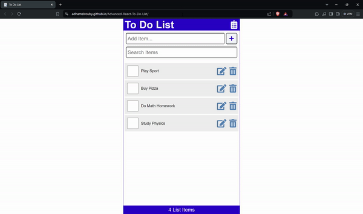

# Advanced React To-Do List

A functional to-do list app with advacned features including task reordering, double-click editing, and more intuitive functionality.

<div align="center">



</div>

## Tech Stack

- 
- 
- 
- 
 
## Features

- **State Management:** Utilizes `useContext` and `Custom Hooks` to manage state and prevent prop drilling.
- **Task Reordering:** Implements `framer-motion` library for smooth task reordering.
- **Notifications:** Integrates `react-toastify` library for displaying messages when tasks are added or deleted.
- **Local Storage:** Preserves client changes using local storage for continuity across sessions.
- **Search Functionality:** Includes a search bar to quickly find tasks. 

## Run Locally

Clone the project

```bash
  git clone https://github.com/AdhamElRouby/Advanced-React-To-Do-List
```

Go to the project directory

```bash
  cd .\Advanced-React-To-Do-List
```

Open with VSCode

```bash
  code .
```

Install dependencies

```bash
  npm install
```

Open with live server

```bash
  npm run dev
```

## Contributing

I welcome contributions to this project! Feel free to submit pull requests and suggest improvements. 
If you have any questions or need assistance, don’t hesitate to contact me at adhamelrouby@aucegypt.edu.

